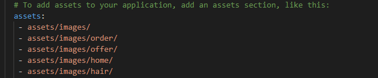
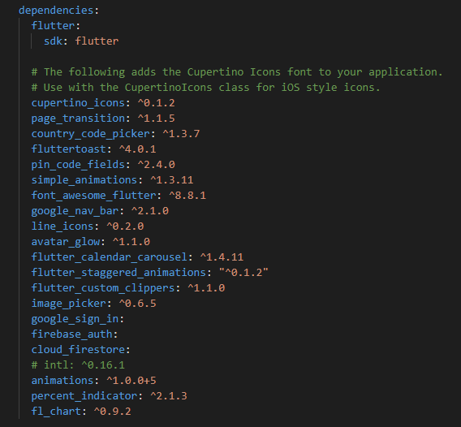

# Stylacs User App.

# Description:
   Stylacs is an app which’ll provide the facility of having make-up at your home and beauticians can have direct communication with        their desired customer.There are millions of folks who are desperately looking for such platform as everyone wants to look beautiful    and on other hand there are many trans genders and women who wants to deal the customers at their place and with all integrity and      respect, and I will reach the user through Android and iOS app, and website and will use all social mediums and will do physical        road shows also.

# Getting Started:
   1. Windows or Mac OS
   2. Flutter SDK
   3. Android Studio
   4. Any IDE
   5. To run and display the app you need an android emulatore or IOS semulatore or a physical device.
   
# Installing & Executing:
   1. Click on clone and then click on download zip to download the Zip folder that contain 2 folders (lib , assets) and a file               (pubspec.yaml).
   2. Now create a new androidx supported flutter project in CMD by using this command (flutter create --androidx project_name). 
   3. Unzip the downloaded folder and copy Lib and assets folder to the newly created flutter project.
   4. Then open pubspec.yaml of downloaded folder and copy all the dependencies and assets and past it to pubspec.yaml of newly created       project.

    
   
   5. Then open the newly project in any IDE and open the pubspec.yaml and save it by pressing (ctrl + s) so that flutter can get all         the mentioned assets and packages.
   6. Connect any physical device to your computer or open your android emulator or IOS simulator. Then open the IDE terminal and type (       flutter run ) to run the project.
   
# Version:
   Version is 2.0
   This is the first version of our app.
   
   
   
   
